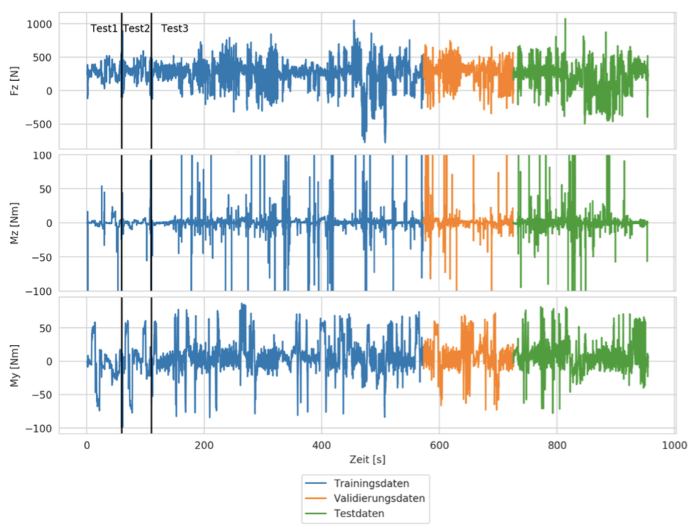

# interpretation-of-pressure-sensors-with-LSTM-networks
For my master's thesis I developed a pressure sensing sock with 19 thin film pressure sensors. The first used case for this prototype was the determination of ground reaction forces while skiing. Because of the amount and the complexity of the sensor data I decided to train a __LSTM-network__ to predict several ground reaction forces. I used a measurement binding plate to generate the target values for the training.

__The observed forces and moments are F_z, M_z and M_y:__
  

__Insights into the pressure sensing sock:__
 

 ---

 ## Research Objective

 I focused on two differen ML-fields.
* Classification: Identification of right and left turns
* Regression: Prediction of F_z, M_z and M_y

I will furthermore focus on the regression problem.
The observed network architectures were:

#### Train-Test-Val-data split shown for the target values
For the training of the NN three test-runs were simulated in the laboratory.

---

## Results for the NN2_3_1_2_Fz, NN2_3_1_2_My and NN2_3_1_2_Mz

| NN | corrcoef |
|---|---|
|  NN2_3_1_2_Fz | 81,6 %  |
|NN2_3_1_2_My|93,5 %|
|NN2_3_1_2_Mz|18,2 %|

__E.g. results for NN2_3_1_2_My with 93.5% correaltion:__
In _red_ the NN-output. In _blue_ the measurement binding data.

(The results will not be discussed here.)

The code for the data-preparation can be found in the folder *Python_Code* under the name *Datenvorbereitung_Regression.ipynb* / *Datenvorbereitung_Kurvenfahrt.ipynb* for the regression/classification. (Unfortunatly I wrote the code description in German. I might change that in the future.)

Hopefuly the code will help some people who try to get startet with LSTM-models using Python and Keras with the tf backend.